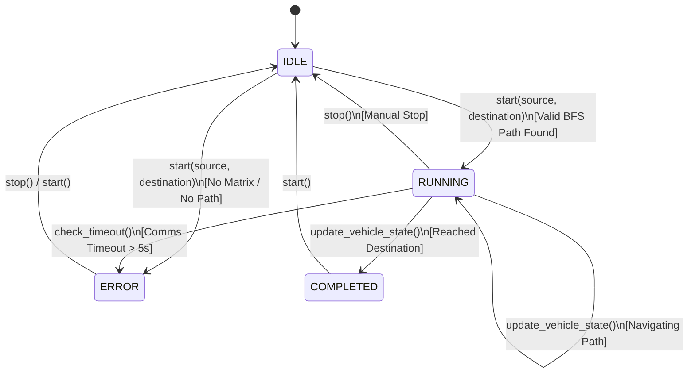
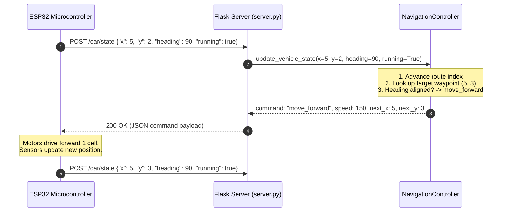

# UGV Autonomous Navigation System

A closed-loop autonomous navigation stack for Unmanned Ground Vehicles (UGV). This project integrates real-time map generation, grid-based path planning (BFS), a stateful closed-loop **Navigation Controller**, and a lightweight **Flask REST API server** that interfaces with onboard microcontrollers (ESP32 / ESP8266) and a real-time web dashboard.

---

## Table of Contents

- [System Architecture](#system-architecture)
- [Coordinate & Heading Conventions](#coordinate--heading-conventions)
- [Module: Navigation Controller (`Navigation_controller.py`)](#module-navigation-controller-navigation_controllerpy)
  - [Core Responsibilities](#core-responsibilities)
  - [Navigation State Machine](#navigation-state-machine)
  - [Heading & Command Calculation](#heading--command-calculation)
  - [Closed-Loop Waypoint Advancement](#closed-loop-waypoint-advancement)
  - [Safety & Fail-Safe Features](#safety--fail-safe-features)
  - [Class & Method Reference](#class--method-reference)
- [Module: Navigation Server (`server.py`)](#module-navigation-server-serverpy)
  - [Core Responsibilities](#core-responsibilities-1)
  - [REST API Reference](#rest-api-reference)
  - [ESP32 Telemetry & Command Protocol](#esp32-telemetry--command-protocol)
  - [Web Dashboard UI](#web-dashboard-ui)
- [Getting Started](#getting-started)
  - [Installation](#installation)
  - [Running the Server](#running-the-server)
  - [Simulating Closed-Loop Navigation](#simulating-closed-loop-navigation)
- [Project Directory Structure](#project-directory-structure)

---

## System Architecture

The navigation system operates in a closed-loop control pipeline:

```mermaid
flowchart TD
    subgraph Vision_and_Mapping [1. Mapping]
        SLAM["SLAM.py\n(GridMapper)"] -->|Generates| ObstacleMatrix["outputs/grid/obstacle_matrix.npy\n(0 = Free, 1 = Obstacle)"]
    end

    subgraph Planning [2. Path Planning]
        ObstacleMatrix --> Planner["Route_planner.py\n(RoutePlanner - BFS)"]
    end

    subgraph Controller_and_Server [3. Navigation Core]
        Planner --> NavCtrl["Navigation_controller.py\n(NavigationController)"]
        NavCtrl <--> FlaskServer["server.py\n(Flask REST API)"]
    end

    subgraph Hardware_and_UI [4. Execution & Monitoring]
        FlaskServer <-->|POST /car/state (Heartbeat & Commands)| ESP32["ESP32 / ESP8266 UGV\n(Motors, IMU/Odometry)"]
        FlaskServer <-->|GET /navigation/status & /map| Dashboard["Browser Dashboard\n(HTML5 Canvas, Vanilla JS)"]
    end
```

### The Closed-Loop Flow
1. **Map Generation**: `SLAM.py` stitches arena camera feeds, thresholding obstacles into a discrete occupancy grid (`obstacle_matrix.npy`).
2. **Mission Dispatch**: The user sets a `source` and `destination` cell via the web dashboard or REST API.
3. **Route Planning**: `NavigationController` invokes `RoutePlanner` (using 4-connected BFS) to find the shortest collision-free path.
4. **Telemetry & Heartbeat**: The ESP32 periodically sends its current coordinates `(x, y)` and heading angle via `POST /car/state`.
5. **Command Generation**: `NavigationController` verifies the vehicle's position, advances waypoints, calculates the necessary steering or throttle command, and replies immediately.
6. **Execution & Feedback**: The ESP32 executes the motion command and sends its newly measured pose on the next tick. The server will **never** advance waypoints until the vehicle's telemetry confirms arrival at the waypoint.

---

## Coordinate & Heading Conventions

To avoid orientation discrepancies across NumPy arrays, network payloads, and robot firmware, the system maintains strict coordinate boundaries:

### Spatial Coordinates

| Environment | Notation | Axis Order | Description |
| :--- | :--- | :--- | :--- |
| **NumPy Matrix & Controller** | `(row, col)` | `row` first, `col` second | `row 0` is top, `col 0` is leftmost. Matches array indexing `matrix[row, col]`. |
| **ESP32 & REST API** | `{"x": col, "y": row}` | `x` first, `y` second | Cartesian-like: `x` represents column index, `y` represents row index. |

> [!NOTE]
> Coordinate translation is handled exclusively at the boundary in `server.py`. Internal controller and planner logic operates strictly on `(row, col)` tuples.

### Heading System (Compass Degrees)

Orientation is measured in cardinal degrees relative to the grid:

```text
               0° (North)
             [-1,  0] (Up)
                  ▲
                  │
270° (West) ◄─────┼─────► 90° (East)
[0, -1] (Left)    │      [0, +1] (Right)
                  ▼
              180° (South)
             [+1,  0] (Down)
```

- **0° (North)**: Heading toward decreasing rows (moving upward in the grid image).
- **90° (East)**: Heading toward increasing columns (moving right).
- **180° (South)**: Heading toward increasing rows (moving downward in the grid image).
- **270° (West)**: Heading toward decreasing columns (moving left).

---

## Module: Navigation Controller (`Navigation_controller.py`)

[Navigation_controller.py](file:///c:/Users/Rishikesh%20N/Desktop/SIH/navigation/Navigation_controller.py) encapsulates the mutable state machine and decision logic of the UGV.

### Core Responsibilities

1. **State Isolation**: Holds the single source of truth via the `@dataclass NavigationState`.
2. **Path Management**: Interfaces with `RoutePlanner` to compute and cache the active waypoint list.
3. **Closed-Loop Waypoint Tracking**: Reconciles noisy sensor positions against the planned trajectory without jumping ahead undesirably.
4. **Command Synthesis**: Translates vehicle pose relative to the next target waypoint into atomic instructions: `move_forward`, `turn_left`, `turn_right`, or `stop`.
5. **Fail-Safe Monitoring**: Implements bounds checks, destination checks, and deadman comms timeout watchdog timers.

### Navigation State Machine



### Heading & Command Calculation

When an incoming heartbeat arrives:
1. `NavigationController` checks if the vehicle's current position matches the next waypoint in the queue.
2. The vector difference between current cell `(r1, c1)` and next waypoint `(r2, c2)` yields the **required heading**:
   $$\Delta r = r_2 - r_1, \quad \Delta c = c_2 - c_1$$
3. The angle difference $\Delta \theta = (\theta_{\text{required}} - \theta_{\text{current}}) \pmod{360}$ determines the action:
   - **$\Delta \theta = 0^\circ$**: Vehicle is aligned $\rightarrow$ `move_forward` with `CRUISE_SPEED` (PWM 150).
   - **$\Delta \theta = 90^\circ$**: Vehicle must steer right $\rightarrow$ `turn_right` by $90^\circ$ with `TURN_SPEED` (PWM 80).
   - **$\Delta \theta = 270^\circ$**: Vehicle must steer left $\rightarrow$ `turn_left` by $90^\circ$ with `TURN_SPEED` (PWM 80).
   - **$\Delta \theta = 180^\circ$**: Target is behind vehicle $\rightarrow$ `turn_right` by $180^\circ$ with `TURN_SPEED` (PWM 80).

### Closed-Loop Waypoint Advancement

The controller implements `_advance_route_index(current_pos)`:
- Instead of unconditionally popping waypoints, it scans the route array backwards from the furthest waypoint down to the current index.
- If the vehicle's reported coordinate matches any waypoint ahead, the index jumps forward to that waypoint.
- This ensures the controller handles positioning noise gracefully while guaranteeing the vehicle cannot "skip" segments prematurely.
- Once `current_pos == destination` and the index reaches the route terminus, the state transitions to `COMPLETED` and emits a `stop` command.

### Safety & Fail-Safe Features

- **Out-of-Bounds Interlock**: If the vehicle reports coordinates outside the dimensions of the grid matrix, an immediate emergency stop is sent.
- **Communication Watchdog (`COMM_TIMEOUT_S = 5.0s`)**: If the vehicle fails to report telemetry within 5 seconds during active navigation, `check_timeout()` trips the controller into `ERROR` state and halts the vehicle.
- **Stop Command Default**: Whenever navigation is halted, completed, unstarted, or invalid, a pre-configured stop payload is emitted:
  ```json
  {
    "command": "stop",
    "speed": 0,
    "turn_angle": null,
    "next_x": null,
    "next_y": null
  }
  ```

### Class & Method Reference

#### `NavigationController(matrix_path=None, arena_width=2.0, arena_height=2.0, vehicle_length_m=0.35, vehicle_width_m=0.20)`
- Initializes controller and auto-loads `obstacle_matrix.npy`.

#### `start(source: Tuple[int, int], destination: Tuple[int, int]) -> Dict`
- Re-reads latest obstacle matrix from disk.
- Runs `RoutePlanner.find_route()`.
- Sets state to `RUNNING` and returns path details (`route`, `route_length`, `cells_visited`).

#### `stop() -> Dict`
- Resets running state and immediately generates a `stop` command packet.

#### `update_vehicle_state(x: int, y: int, heading: int, running: bool) -> Dict`
- Accepts ESP32 pose telemetry.
- Translates `(x, y)` to `(row, col)`.
- Updates waypoint index, checks safety limits, and computes the next motion command.

#### `check_timeout() -> Optional[Dict]`
- Evaluates elapsed time since `last_update_time`. If exceeded, triggers communication abort.

#### `get_status() -> Dict`
- Returns a complete JSON-serializable snapshot of navigation state for the dashboard and debug endpoints.

---

## Module: Navigation Server (`server.py`)

[server.py](file:///c:/Users/Rishikesh%20N/Desktop/SIH/navigation/server.py) is a multi-threaded Flask server providing HTTP endpoints for mission control, vehicle telemetry, map inspection, and dashboard rendering.

### Core Responsibilities

1. **Thread-Safe Controller Synchronization**: Wraps all mutations and status inquiries in a `threading.Lock()` to prevent race conditions between incoming vehicle heartbeats and operator web requests.
2. **Coordinate Adapter**: Converts external ESP32 `{x, y}` payloads to internal `(row, col)` representations and vice versa.
3. **Packet Telemetry Ring Buffer**: Maintains the last 30 communication transactions (`rx` and `tx`) in a memory ring buffer (`collections.deque(maxlen=30)`).
4. **Static & Dashboard Host**: Serves the single-page HTML5/Canvas mission control dashboard.

---

### REST API Reference

#### 1. Start Navigation
- **Endpoint**: `POST /navigation/start`
- **Description**: Computes route between source and destination and initiates navigation.
- **Request Body**:
  ```json
  {
    "source": [0, 0],
    "destination": [19, 19]
  }
  ```
  *(Note: `[row, col]` format)*
- **Response (`200 OK`)**:
  ```json
  {
    "status": "ok",
    "data": {
      "status": "started",
      "source": [0, 0],
      "destination": [19, 19],
      "route": [[0, 0], [0, 1], [1, 1], ...],
      "route_length": 38,
      "cells_visited": 142,
      "grid_rows": 20,
      "grid_cols": 20,
      "message": "Route found: 38 steps"
    }
  }
  ```

#### 2. Stop Navigation
- **Endpoint**: `POST /navigation/stop`
- **Description**: Halts navigation immediately.
- **Response (`200 OK`)**:
  ```json
  {
    "status": "ok",
    "data": {
      "status": "stopped",
      "command": {
        "command": "stop",
        "speed": 0,
        "turn_angle": null,
        "next_x": null,
        "next_y": null,
        "timestamp": 1725963200.12
      }
    }
  }
  ```

#### 3. Vehicle State Heartbeat (Primary ESP32 Endpoint)
- **Endpoint**: `POST /car/state`
- **Description**: Transmits vehicle telemetry to server; receives next execution command.
- **Request Body**:
  ```json
  {
    "x": 0,
    "y": 0,
    "heading": 0,
    "running": true
  }
  ```
- **Response (`200 OK`)**:
  ```json
  {
    "command": "turn_right",
    "speed": 80,
    "turn_angle": 90,
    "next_x": 1,
    "next_y": 0,
    "timestamp": 1725963205.54
  }
  ```

#### 4. Navigation Status Polling
- **Endpoint**: `GET /navigation/status`
- **Description**: Polled by dashboard (~750 ms interval). Also checks for comms watchdog timeouts.
- **Response (`200 OK`)**: Contains controller state (`status`, `route`, `current_position`, `current_heading`, `seconds_since_update`) and the rolling `packet_log`.

#### 5. Map & Route Inspection
- **Endpoint**: `GET /map`
  - Returns the obstacle grid matrix (`rows`, `cols`, and 2D array of `0`s and `1`s).
- **Endpoint**: `GET /route`
  - Returns the current route waypoint list and length.
- **Endpoint**: `GET /car/state`
  - Debug inspection of last recorded vehicle pose and command.

---

### ESP32 Telemetry & Command Protocol



#### Valid Commands Generated by the Server
- `move_forward`: Drive straight at `CRUISE_SPEED` (PWM 150).
- `turn_left`: Turn counter-clockwise by `turn_angle` (typically 90°) at `TURN_SPEED` (PWM 80).
- `turn_right`: Turn clockwise by `turn_angle` (90° or 180°) at `TURN_SPEED` (PWM 80).
- `stop`: Halt all motors (`speed: 0`).

---

### Web Dashboard UI

The server serves an interactive, framework-free web dashboard at `http://localhost:5000`:
- **HTML5 Canvas Map**: Real-time rendering of obstacle cells, vehicle icon oriented with current heading, planned path line, and waypoints.
- **Interactive Route Setup**: Click cells to set Source and Destination interactively, or enter coordinates manually.
- **Live Telemetry & Diagnostics**: Monitors vehicle coordinates, heading, route progress, comms health, and error messages.
- **Packet Inspector**: Displays real-time inbound (`RX`) and outbound (`TX`) JSON payloads with timestamps.

---

## Getting Started

### Installation

Ensure Python 3.8+ is installed. Activate your virtual environment and install dependencies:

```powershell
# In project root
.\venv\Scripts\Activate.ps1
pip install -r navigation/requirements.txt
```

Required packages:
- `flask`
- `numpy`
- `opencv-python`
- `matplotlib`

### Running the Server

Make sure an obstacle matrix exists in `outputs/grid/obstacle_matrix.npy`. If not, generate one with:

```powershell
python navigation/SLAM.py
```

Then launch the navigation server:

```powershell
python navigation/server.py
```

Console output:
```text
============================================================
  UGV Navigation Server
  Matrix: C:\Users\...\SIH\outputs\grid\obstacle_matrix.npy
  Dashboard: http://localhost:5000
============================================================
 * Running on all addresses (0.0.0.0)
 * Running on http://127.0.0.1:5000
```

Open your browser and navigate to `http://localhost:5000`.

---

### Simulating Closed-Loop Navigation

You can test the entire closed-loop system using PowerShell or curl without physical hardware:

#### 1. Start a mission
```powershell
$headers = @{ "Content-Type" = "application/json" }
$body = '{"source": [0, 0], "destination": [19, 19]}'
Invoke-RestMethod -Uri "http://localhost:5000/navigation/start" -Method Post -Headers $headers -Body $body
```

#### 2. Send initial vehicle heartbeat
```powershell
$carPacket = '{"x": 0, "y": 0, "heading": 0, "running": true}'
$cmd = Invoke-RestMethod -Uri "http://localhost:5000/car/state" -Method Post -Headers $headers -Body $carPacket
$cmd | ConvertTo-Json
```

#### 3. Inspect Navigation Status
```powershell
Invoke-RestMethod -Uri "http://localhost:5000/navigation/status" -Method Get | ConvertTo-Json -Depth 3
```

#### 4. Stop Navigation
```powershell
Invoke-RestMethod -Uri "http://localhost:5000/navigation/stop" -Method Post
```

---

## Project Directory Structure

```text
SIH/
├── README.md                           # Main documentation (this file)
├── tasks.txt                           # System development task tracker
├── navigation/
│   ├── Navigation_controller.py        # Core state machine & closed-loop command logic
│   ├── server.py                       # Flask REST server & API endpoints
│   ├── Route_planner.py                # BFS shortest-path planning module
│   ├── SLAM.py                         # Vision-based obstacle grid mapper
│   ├── requirements.txt                # Python dependencies (flask, numpy, opencv)
│   ├── templates/
│   │   └── index.html                  # Mission control web dashboard
│   └── static/
│       ├── style.css                   # Dashboard styling & responsive layout
│       └── app.js                      # Canvas renderer & polling client
└── outputs/
    └── grid/
        ├── grid_image.png              # Annotated input arena image
        ├── obstacle_matrix.png         # Binary map visualizer
        └── obstacle_matrix.npy         # Serialized 2D NumPy obstacle matrix
```